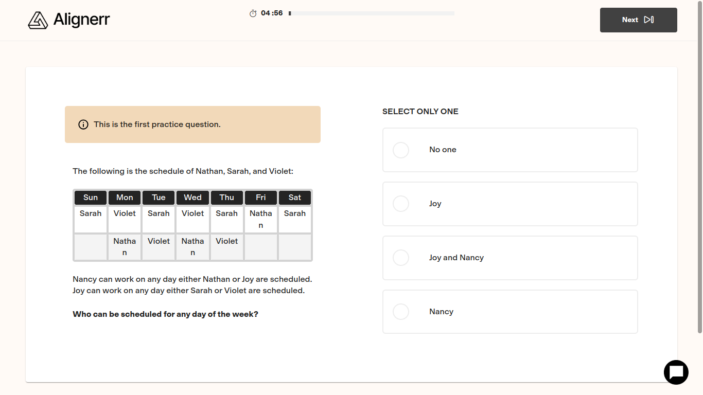
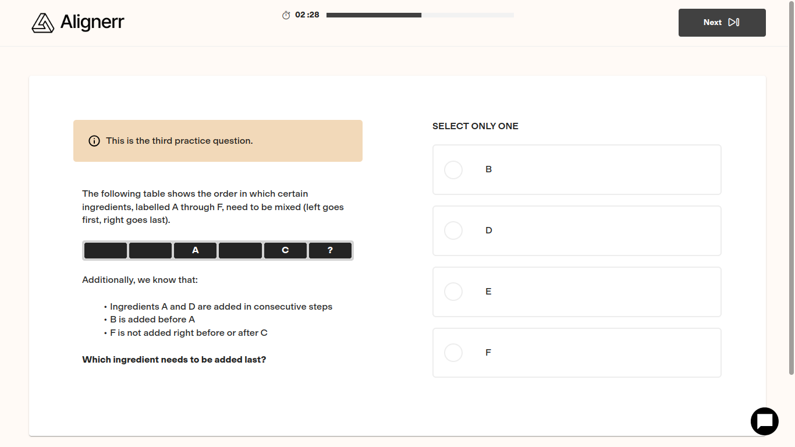
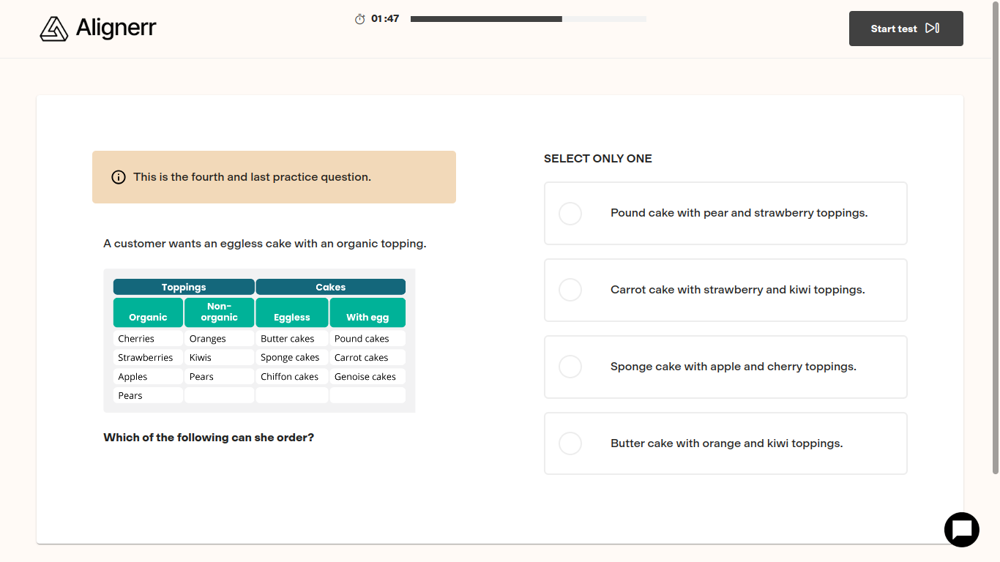
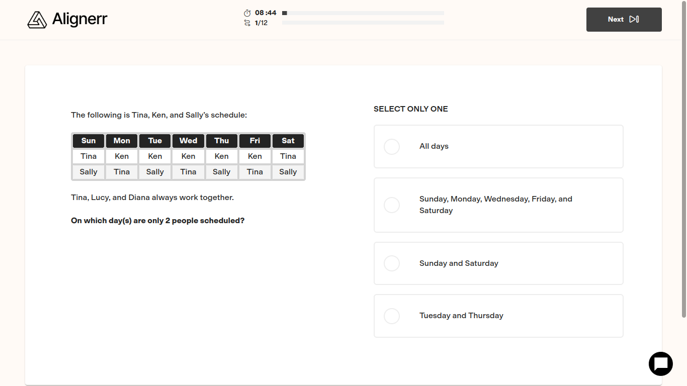
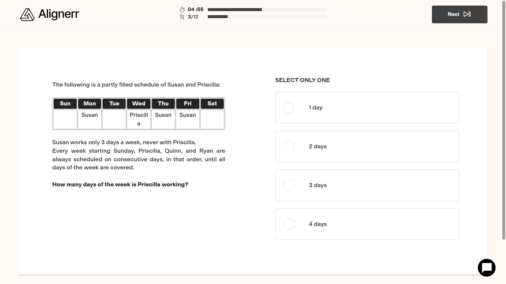
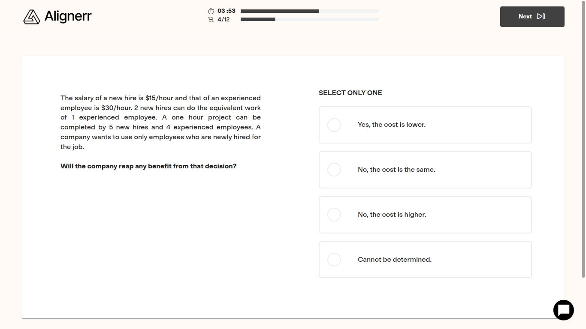
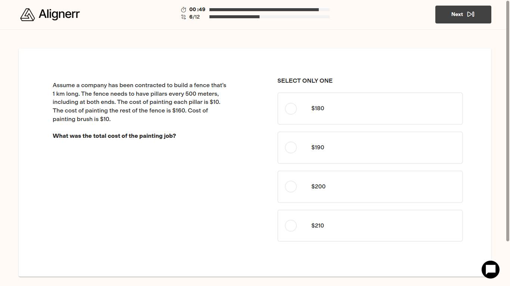

# Test answers

## Q1: Rotating a Matrix Anticlockwise

  ```python
  # Function to rotate the image anticlockwise
  def rotate_image(size, img):
      # Check if the image matrix matches the specified size
      if len(img) != size or any(len(row) != size for row in img):
          raise ValueError('Matrix size must match dimension')
      
      # Transpose and reverse the rows to rotate 90 degrees anticlockwise
      new_img = [list(row) for row in zip(*img)]
      rotated_img = new_img[::-1]
      return rotated_img

  # Read input values from stdin
  size = int(input().strip())
  img = []
  for _ in range(size):
      row = list(map(int, input().strip().split()))
      img.append(row)

  # Call rotate_image and update img with the rotated image
  img = rotate_image(size, img)

  # Print the rotated image without spaces after the last element
  for row in img:
      print(" ".join(map(str, row)))
  ```

## Q2: The `decipher` Function

  ```python
  def decipher(ciphertext, knownWord):
      # Split ciphertext by spaces to find potential encrypted matches for knownWord
      encrypted_words = ciphertext.split()
      
      # Search for a potential match for knownWord in ciphertext
      for encrypted_word in encrypted_words:
          if len(encrypted_word) == len(knownWord):
              # Calculate the shift using the first character
              shift = (ord(encrypted_word[0]) - ord(knownWord[0])) % 26
              
              # Check if the entire encrypted_word matches the knownWord with this shift
              if all((ord(encrypted_word[i]) - ord(knownWord[i])) % 26 == shift for i in range(len(knownWord))):
                  # Apply reverse shift to decrypt the entire ciphertext
                  decrypted_text = []
                  for char in ciphertext:
                      if 'a' <= char <= 'z':  # Decrypt lowercase letters
                          decrypted_char = chr((ord(char) - ord('a') - shift) % 26 + ord('a'))
                      elif 'A' <= char <= 'Z':  # Decrypt uppercase letters
                          decrypted_char = chr((ord(char) - ord('A') - shift) % 26 + ord('A'))
                      else:
                          decrypted_char = char  # Non-alphabetic characters remain unchanged
                      decrypted_text.append(decrypted_char)
                  
                  return ''.join(decrypted_text)
      
      # If no valid match is found, return "Invalid"
      return "Invalid"

  # Read input values
  ciphertext = input().strip()
  knownWord = input().strip()

  # Call decipher and print the result
  result = decipher(ciphertext, knownWord)
  print(result)
  ```

## Q3: Comp Science Competency questions

### A: Identify the Logical Error

**Prompt:**  
Identify the logical error in this palindrome-checking code:

```python
def is_palindrome(s):
    s = s.lower().replace(" ", "")
    for i in range(len(s)):
        if s[i] != s[-(i + 1)]:
            return False
    return True
```

**Answer:**  
The `range(len(s))` should be `range(len(s) // 2)` to avoid extra comparisons ie you should loop to half the length.

### B: Improve Time Complexity

**Prompt:**  
Optimize the time complexity of this code to find the first unique character.

```java
public static char findFirstNonRepeatedCharacter(String str) {
    for (int i = 0; i < str.length(); i++) {
        boolean unique = true;
        for (int j = 0; j < str.length(); j++) {
            if (i != j && str.charAt(i) == str.charAt(j)) {
                unique = false;
                break;
            }
        }
        if (unique) return str.charAt(i);
    }
    return '\0';
}
```

**Answer:**  
Use a `HashMap` to store character frequencies, then find the first character with frequency 1. Complexity improves from \(O(n^2)\) to \(O(n)\).

---

### C: Determine Time and Space Complexity

**Prompt:**  
Find the time and space complexity of this code:

```cpp
void findMin(int arr[], int n) {
    int min = arr[0];
    for (int i = 1; i < n; i++) {
        if (arr[i] < min) min = arr[i];
    }
}
```

**Answer:**  

- **Time:** \(O(n)\)
- **Space:** \(O(1)\)

## Q4 : Problem solving questions









